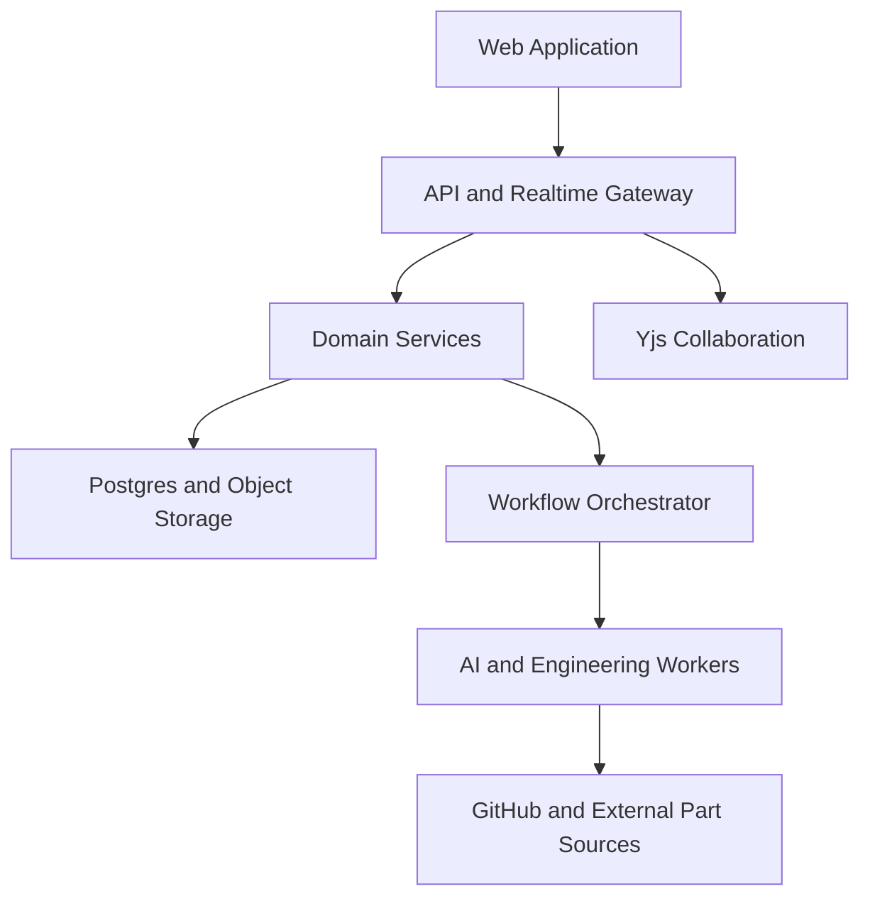

# FOUNDRY

## Product Requirements Document and Cursor Implementation Specification

**Working name:** FOUNDRY
**Tagline:** Describe it. Engineer it. Build it. Sell it.
**Document version:** 0.1
**Status:** Implementation source of truth
**Primary audience:** Product, design, frontend, backend, AI, electrical, mechanical, firmware, infrastructure, and Cursor coding agents

---

## 0. Instructions to Cursor

This document is the product and implementation contract for FOUNDRY. Treat normative language as follows:

- **MUST**: required for the corresponding acceptance criteria to pass.
- **SHOULD**: expected unless there is a documented technical reason to defer.
- **MAY**: optional or future-facing.

When implementing:

1. Read this entire document before generating architecture or code.
2. Create small, reviewable changes. Do not attempt to implement the whole product in a single pass.
3. Preserve a clean separation between domain models, external adapters, orchestration, UI, and infrastructure.
4. Use typed contracts for every service boundary and shared event.
5. Never present mocked engineering output as verified or manufacturing-ready.
6. Local/demo adapters are allowed, but their output MUST be labeled `SIMULATED` or `UNVERIFIED`.
7. Agents MUST propose changes as diffs and MUST NOT silently overwrite user work.
8. GitHub is the source of truth for product software. FOUNDRY is the source of truth for live collaboration state, the product graph, research, validation, and releases.
9. Large binary artifacts MUST live in object storage or Git LFS. Store manifests, hashes, provenance, and relationships in Postgres and the product graph.
10. Every external integration MUST sit behind an interface so it can be replaced without rewriting domain logic.
11. Add tests with each feature. Do not mark a feature complete solely because a UI renders.
12. If a requirement is ambiguous, choose the implementation that best preserves traceability, reversibility, human approval, and engineering correctness.

The recommended build order appears in Section 25.

---

## 1. Executive Summary

FOUNDRY is a collaborative, AI-native environment for creating complete physical products.

A user describes a product in natural language, uploads sketches or references, and collaborates with people and specialized agents through four editable stages:

1. **Ideate** — research, requirements, diagrams, component discovery, and visual concept generation.
2. **Engineer** — synchronized electronics, mechanical CAD, and software/firmware workspaces.
3. **Verify** — visual inspection, electrical checks, geometry checks, compilation, simulation, integration testing, and human approval.
4. **Launch** — immutable releases, manufacturing exports, product media, documentation, and a Shopify-style storefront builder.

The core differentiator is a shared **Product Graph**. A battery, sensor, connector, PCB, enclosure opening, firmware driver, telemetry field, render, documentation entry, and product listing are not disconnected files. They are related representations of one product system.

When a user changes a component or requirement, FOUNDRY identifies affected artifacts, marks downstream results stale, proposes synchronized updates, reruns validation, and presents the change as a reviewable diff.

### One-sentence pitch

> Cursor generates software; FOUNDRY collaboratively generates the circuit, mechanical design, code, renders, manufacturing package, and storefront for a real physical product.

### Demo statement

> We described a product, researched its components, generated a concept, collaboratively edited its circuit board, frame, and firmware, let agents inspect it from every angle, verified it, fabricated it, and published a store selling it without leaving one workspace.

---

## 2. Problem

Physical-product development is fragmented across incompatible tools and file formats:

- product requirements live in documents and chat threads;
- electrical work lives in EDA tools;
- mechanical work lives in CAD tools;
- firmware lives in Git repositories;
- component research lives in browser tabs and PDFs;
- simulations live in separate engineering packages;
- renders live in creative tools;
- manufacturing outputs live in exported folders;
- commerce and product pages are recreated manually after engineering.

This fragmentation creates several common failures:

1. Changes do not propagate across disciplines.
2. Teams lose the reason a component or design decision was chosen.
3. Electrical, mechanical, and software interfaces drift out of sync.
4. AI tools generate isolated artifacts without proving they belong to one buildable product.
5. Non-experts can generate attractive concepts but cannot reliably translate them into editable engineering artifacts.
6. Existing collaboration models are file-oriented rather than system-oriented.
7. Product teams repeatedly convert the same information into renders, documentation, listings, and manufacturing packages.

FOUNDRY solves this by treating the physical product as a versioned, collaborative, machine-readable system rather than a folder of unrelated files.

---

## 3. Product Vision

FOUNDRY should make physical engineering iterate at the speed and collaboration level of modern software development while retaining the verification, traceability, and human judgment required for real hardware.

Long term, FOUNDRY becomes the environment in which a person or team can move from intent to a manufactured and sellable physical product.

The system is not merely:

- a text-to-CAD generator;
- a PCB copilot;
- an image generator;
- a browser code editor;
- a component search engine;
- a Shopify theme generator.

It is the shared product model and orchestration layer connecting all of these functions.

---

## 4. Target Users

### 4.1 Primary users

1. **Makers and technical hobbyists** who can describe and iterate on an idea but need help across electrical, mechanical, and software disciplines.
2. **Student engineering teams** building robots, drones, wearables, IoT systems, vehicles, instruments, or competition hardware.
3. **Independent hardware founders** who need to move from prototype to preorders with a small team.
4. **Multidisciplinary engineering teams** that need one traceable workspace across EE, ME, firmware, industrial design, and product.
5. **Designers and creators** who can define product form and experience but need engineering translation and validation.

### 4.2 Secondary users

- educators and engineering programs;
- component vendors and manufacturers;
- contract manufacturers and fabrication partners;
- open-source hardware communities;
- customers purchasing devices, kits, or design licenses from FOUNDRY storefronts.

### 4.3 Personas

#### Builder

Starts a project from a prompt, edits all stages, invokes agents, and creates releases.

#### Electrical engineer

Owns schematic, PCB, power, signal, and component decisions.

#### Mechanical engineer

Owns parametric CAD, assemblies, constraints, materials, and manufacturing geometry.

#### Firmware/software engineer

Works primarily in GitHub but uses FOUNDRY for product context, quick edits, preview, builds, and hardware-aware validation.

#### Industrial designer

Owns concept direction, materials, visual form, renders, and product presentation.

#### Reviewer

Comments, runs or reviews validation, approves stage gates, and signs releases.

#### Merchant

Builds public product pages, configures listings, pricing, inventory, licenses, and orders.

---

## 5. Goals, Non-Goals, and Product Principles

### 5.1 Goals

FOUNDRY MUST:

1. Support multi-user workspaces and projects.
2. Provide editable Ideate, Engineer, Verify, and Launch stages.
3. Maintain a shared product graph across all stages.
4. Support live collaboration in research, diagrams, PCB, CAD operations, code quick-edit sessions, renders, and sites.
5. Integrate product software with GitHub as its canonical repository.
6. Let agents research external components and import symbols, footprints, 3D models, datasheets, and metadata with provenance.
7. Generate visual concepts before engineering while separating visual reference from authoritative geometry.
8. Generate or modify editable electronics, CAD, firmware, application code, documentation, and storefront artifacts.
9. Let agents capture and inspect the product from standard and custom camera angles.
10. Run real verification tools where available and label simulated results where not.
11. Track dependencies and invalidate downstream artifacts when upstream facts change.
12. Create immutable releases that can drive manufacturing and commerce.
13. Allow projects or project releases to be sold as physical products, kits, files, licenses, or remixable templates.

### 5.2 Non-goals for the first complete product

FOUNDRY is not initially intended to:

1. Replace expert sign-off for medical, aerospace, automotive safety, mains voltage, RF certification, or other regulated designs.
2. Guarantee that arbitrary generated hardware is safe or manufacturable without explicit verification.
3. Build a proprietary geometry kernel from scratch.
4. Build a proprietary PCB router from scratch unless later justified.
5. Train every foundation model internally.
6. Support every EDA/CAD format at launch.
7. Allow agents to publish, purchase, manufacture, merge, or deploy without configured human approval.

### 5.3 Product principles

1. **Editable over magical:** every generated artifact must remain editable.
2. **System-aware over isolated:** artifacts must reference shared components, requirements, and interfaces.
3. **Verified over plausible:** a render is not evidence that a product works.
4. **Diffs over silent mutation:** all consequential agent actions are reviewable.
5. **Provenance over copy-paste:** parts, assets, claims, and generated outputs retain sources and licenses.
6. **Human gates over full autonomy:** users approve concept lock, engineering baseline, release, and publication.
7. **Open formats over lock-in:** prefer KiCad, STEP, STL, source code, Markdown, JSON, and documented exports.
8. **GitHub-native code:** FOUNDRY complements rather than replaces professional code workflows.

---

## 6. Information Architecture

```text
Workspace
├── Memberships[]
├── WorkspaceRoles[]
├── ComponentLibrary
├── AssetLibrary
├── Projects[]
│   ├── ProjectMembers[]
│   ├── ResearchHub
│   ├── ProductGraph
│   ├── Branches[]
│   ├── Stage 1: Ideate
│   ├── Stage 2: Engineer
│   │   ├── Electronics
│   │   ├── Mechanical
│   │   └── Software
│   ├── Stage 3: Verify
│   ├── Stage 4: Launch
│   ├── GitHubConnection
│   ├── AgentRuns[]
│   ├── ValidationRuns[]
│   ├── Artifacts[]
│   └── Releases[]
└── Sites[]
    ├── SiteMembers[]
    ├── Pages[]
    ├── Theme
    ├── Listings[] -> ProjectRelease
    ├── CheckoutConfiguration
    ├── Orders[]
    └── Domains[]
```

### 6.1 Why Sites belong to Workspace

A storefront may sell multiple products. Therefore, a `Site` belongs to a `Workspace` and a `Listing` references an immutable `ProjectRelease`.

A project MAY also have a generated single-product landing-page draft, but publication still occurs through a workspace site.

### 6.2 Stage state

Each stage has one of these states:

- `NOT_STARTED`
- `DRAFT`
- `RUNNING`
- `NEEDS_REVIEW`
- `APPROVED`
- `BLOCKED`
- `STALE`

An upstream change MUST mark affected approved downstream stages or validations `STALE`. Stale does not delete work; it communicates that prior approval no longer covers the current product graph.

---

## 7. Roles and Permissions

### 7.1 Workspace roles

- **Owner:** all permissions, billing, deletion, role management.
- **Admin:** manages members, projects, sites, integrations, and policies.
- **Member:** creates and edits permitted projects.
- **Guest:** scoped access to specified projects or stages.

### 7.2 Project permissions

Permissions MUST be capability-based rather than hard-coded only to roles:

- `project.read`
- `project.manage`
- `research.edit`
- `ideate.edit`
- `electronics.edit`
- `mechanical.edit`
- `software.edit`
- `verification.run`
- `verification.approve`
- `release.create`
- `release.approve`
- `agent.invoke`
- `agent.apply`
- `github.connect`
- `site.edit`
- `site.publish`
- `commerce.manage`

### 7.3 Agent permissions

Agent actions MUST use scoped capability grants. Examples:

- research may search and download but not modify engineering artifacts;
- a CAD agent may propose geometry changes but not publish a release;
- a code agent may push only to an agent branch and open a pull request;
- a commerce agent may draft listing copy but not publish or change payout settings.

Every agent tool invocation MUST record actor, scope, inputs, outputs, timestamp, affected objects, and provenance.

---

## 8. Core User Journeys

### 8.1 Create a product from a prompt

1. User creates or selects a workspace.
2. User clicks **New Project**.
3. User enters a prompt, budget, size, intended use, and optional references.
4. FOUNDRY creates the initial research thread and draft requirements.
5. Research agent creates a cited overview, block diagram, candidate components, and risks.
6. Concept agent generates multiple concept directions.
7. User edits requirements and selects or combines concepts.
8. User locks a concept baseline and enters Engineer.

### 8.2 Collaboratively engineer the product

1. Electrical, mechanical, and software collaborators open the same project.
2. Each sees live presence and selections across relevant editors.
3. The electrical user selects a component from research and promotes it into the schematic.
4. The component's footprint and 3D representation become available to PCB and CAD.
5. The mechanical user places the board and constrains enclosure openings.
6. The software user links GitHub and generates a driver branch.
7. Changes produce dependency events and validation requirements.
8. Agents propose synchronized patches; humans review and apply them.

### 8.3 Replace a component globally

1. User asks: “Replace the ultrasonic sensor with a LiDAR sensor under $30.”
2. Research agent searches approved sources and compares candidates.
3. User selects a specific manufacturer part.
4. FOUNDRY imports or generates its symbol, footprint, 3D model, and driver references.
5. Product Graph replacement impact is displayed before mutation.
6. Proposed changes cover schematic, PCB, power budget, CAD mount, firmware, tests, BOM, render, documentation, and listing specifications.
7. Users accept changes individually or as a batch.
8. Validation reruns and failures are linked to affected objects.

### 8.4 Validate and release

1. User requests a full verification run.
2. FOUNDRY creates an immutable input snapshot.
3. Specialized workers run visual, electrical, mechanical, code, integration, BOM, and policy checks.
4. Results appear in a unified issue list and evidence report.
5. Users resolve or explicitly waive issues with rationale and approver identity.
6. Authorized reviewer approves the product graph snapshot.
7. A release freezes artifacts, Git commit SHAs, dependency versions, validations, and approval records.

### 8.5 Publish and sell

1. Merchant creates or opens a site.
2. Merchant adds an approved project release as a listing.
3. FOUNDRY generates product copy, specifications, galleries, exploded views, downloads, and configuration options from release data.
4. Merchant edits the page in a multiplayer visual editor.
5. Merchant selects sale mode: physical product, preorder, kit, file download, license, or remix template.
6. Merchant configures price, inventory, shipping, taxes, terms, and domain.
7. Authorized user publishes the site.

---

## 9. Product Graph

The Product Graph is the central domain model. It is not merely a visualization graph; it is the typed dependency and provenance model connecting the product.

### 9.1 Core node types

- `Requirement`
- `Decision`
- `Risk`
- `Component`
- `Part`
- `Interface`
- `ElectricalNet`
- `MechanicalFeature`
- `Assembly`
- `SoftwareModule`
- `FirmwareDriver`
- `TelemetryField`
- `TestCase`
- `Artifact`
- `Asset`
- `Source`
- `ValidationResult`
- `ListingField`

### 9.2 Core edge types

- `SATISFIES`
- `VIOLATES`
- `DEPENDS_ON`
- `CONNECTS_TO`
- `MOUNTS_TO`
- `IMPLEMENTS`
- `USES_PIN`
- `USES_PROTOCOL`
- `GENERATED_FROM`
- `VALIDATED_BY`
- `RENDERS`
- `DOCUMENTS`
- `LISTS`
- `SUPERSEDES`
- `CONFLICTS_WITH`

### 9.3 Example

```text
BME280 Part
├── represented_by -> Schematic Symbol
├── represented_by -> PCB Footprint
├── represented_by -> STEP Model
├── connects_to -> I2C Interface
├── uses_pin -> MCU PB8 / PB9
├── implemented_by -> Firmware Driver
├── emits -> temperature_c TelemetryField
├── mounted_by -> Sensor Boss MechanicalFeature
├── validated_by -> Sensor Read Test
└── documented_by -> Product Specification
```

### 9.4 Dependency invalidation

Every mutating operation MUST emit a typed domain event. A dependency service consumes events and determines which derived artifacts and validations are stale.

Example:

```text
PartReplaced
  -> Invalidate schematic checks
  -> Invalidate PCB placement/routing checks
  -> Invalidate power budget
  -> Invalidate CAD mount and clearance
  -> Invalidate firmware build and driver tests
  -> Invalidate renders containing old geometry
  -> Invalidate release readiness
```

### 9.5 Product graph requirements

- Every graph mutation MUST be versioned.
- Every node and edge MUST have an origin: user, import, agent, or system.
- Agent-generated facts MUST distinguish inference from sourced fact.
- All quantities MUST include units.
- Conflicting values MUST coexist as unresolved alternatives rather than silently overwriting each other.
- Released graph snapshots MUST be immutable.

---

## 10. Research Hub

Research is a persistent project-wide surface, not a disposable chat.

### 10.1 Required views

1. **Chats** — threaded user/agent conversations with citations and tool activity.
2. **Canvas** — collaborative diagrams, block diagrams, flows, and architecture maps.
3. **Assets** — images, sketches, PDFs, datasheets, symbols, footprints, 3D models, and code references.
4. **Components** — candidate and approved parts with comparison tables.
5. **Sources** — provenance, license, retrieval date, and trust status.
6. **Decision log** — accepted, rejected, and superseded decisions with rationale.

### 10.2 Promotion actions

Users MUST be able to promote research output into:

- requirement;
- risk;
- component candidate;
- approved part;
- design reference;
- mechanical constraint;
- electrical constraint;
- code requirement;
- test case;
- listing claim.

### 10.3 Component search

The component research agent MUST support:

- natural-language search;
- structured filters: voltage, current, package, dimensions, protocol, operating range, lifecycle, stock, price, and preferred supplier;
- side-by-side comparison;
- authoritative datasheet retrieval;
- source ranking;
- duplicate manufacturer-part-number detection;
- asset import and pin-map validation;
- explicit confidence and unresolved warnings.

### 10.4 Part asset ingestion

For each approved part, FOUNDRY attempts to acquire:

- manufacturer and manufacturer part number;
- datasheet;
- schematic symbol;
- PCB footprint;
- 3D model;
- simulation model where available;
- supplier offers;
- lifecycle status;
- license and source metadata.

Imported files MUST be malware-scanned, type-validated, hashed, and placed in a quarantined state until automated checks pass.

The pin map from an imported symbol/footprint MUST be compared against the authoritative datasheet. Mismatches block approval.

---

## 11. Stage 1 — Ideate

### 11.1 Inputs

- natural-language brief;
- sketches;
- uploaded images;
- mood boards;
- dimensions;
- budget;
- intended environment;
- performance targets;
- manufacturing preferences;
- target audience;
- user-selected reference products.

### 11.2 Requirement editor

Requirements MUST be editable as structured objects with:

- description;
- type;
- priority;
- numeric bounds and units;
- source;
- rationale;
- verification method;
- owner;
- status;
- linked product-graph nodes.

Requirement types include functional, electrical, mechanical, software, visual, manufacturing, cost, compliance, and user-experience.

### 11.3 Concept generation

The concept agent SHOULD:

1. Produce multiple distinct concept families rather than one image.
2. Include a written design rationale for each.
3. Identify which visible features satisfy which requirements.
4. Avoid introducing unsupported interfaces or components without labeling them conceptual.
5. Generate a consistent multiview reference after selection.
6. Allow masked edits, regional edits, variations, and combination of concepts.

### 11.4 Concept consistency validation

The system MUST generate or request:

- front;
- rear;
- left;
- right;
- top;
- bottom;
- isometric;
- optional exploded or open-enclosure view.

A vision validator compares views for:

- feature count;
- port position;
- button position;
- symmetry;
- proportions;
- material consistency;
- silhouette consistency;
- component plausibility.

Independent views are never treated as authoritative geometry. The system records a concept-consistency score and highlighted contradictions.

### 11.5 Concept-to-CAD paths

#### Path A: image-first

1. Selected multiview concept.
2. Coarse 3D reconstruction or generated mesh.
3. Mesh cleanup and scale alignment.
4. Feature recognition.
5. Parametric CAD reconstruction or CAD agent imitation.
6. Render and compare against concept.

#### Path B: CAD-first

1. Selected concept and requirements.
2. Agent writes parametric CAD operations.
3. Geometry kernel executes operations.
4. Renderer generates standard views.
5. Vision validator compares rendered result to concept.
6. Agent modifies parameters until within tolerance or requests human input.

Path B is preferred for authoritative engineering. Path A is useful for form exploration.

### 11.6 Stage gate

Ideate can be approved only when:

- required fields in the brief are complete;
- critical unknowns are either resolved or marked assumptions;
- selected concept exists;
- multiview reference exists;
- initial product architecture diagram exists;
- initial risks exist;
- user explicitly approves concept lock.

---

## 12. Stage 2 — Engineer

Engineer contains Electronics, Mechanical, and Software surfaces. Users may open them in tabs or split view.

### 12.1 Shared behavior

All engineering editors MUST support:

- multiplayer presence;
- selections and cursors;
- comments anchored to objects;
- user and agent change attribution;
- undo/redo;
- checkpoints;
- branches;
- diffs;
- object history;
- dependency warnings;
- stale-state indicators;
- agent proposals;
- export.

### 12.2 Electronics editor

#### Required capabilities

- schematic sheets and hierarchy;
- symbol placement and editing;
- wire, bus, label, and net editing;
- electrical rules configuration;
- PCB board outline;
- footprint placement;
- copper layers;
- routing and vias;
- design-rule configuration;
- zones and planes;
- 3D board preview;
- BOM and component alternatives;
- netlist synchronization;
- KiCad-compatible import/export;
- ERC and DRC execution;
- visual diff between versions.

#### Agent capabilities

- generate a block diagram;
- generate a draft schematic;
- select or replace parts;
- import symbols, footprints, and 3D models;
- wire a selected subsystem;
- assign pins;
- generate or edit board outline based on CAD constraints;
- propose placement;
- propose routing;
- run ERC/DRC;
- diagnose and patch issues;
- calculate power budget;
- explain every modification.

#### Collaboration constraint

Do not merge opaque KiCad files at keystroke level. Maintain an internal structured operation model and deterministically materialize KiCad artifacts. For topology-sensitive actions, use object-level or region-level leases.

### 12.3 Mechanical editor

#### Required capabilities

- parametric parts;
- sketches and constraints;
- extrusion, revolve, sweep, loft, fillet, chamfer, shell, boolean, pattern, and hole operations;
- assemblies and mates;
- imported STEP/STL references;
- board and component placement;
- measurement tools;
- section view;
- exploded view;
- materials and finishes;
- interference and clearance inspection;
- versioned feature tree;
- STEP/STL export;
- render handoff.

#### Agent capabilities

- create geometry from requirements;
- reconstruct parametric CAD from concept references;
- generate enclosures, frames, brackets, and mounts;
- place PCB and component assets;
- align ports and cutouts;
- choose fasteners;
- run collision and basic manufacturability checks;
- create variants;
- capture standard views;
- explain geometry operations and dimensions.

#### Collaboration constraint

Yjs synchronizes the feature-operation graph and metadata, not arbitrary kernel state. A geometry service is authoritative for evaluated shapes. Topology-changing operations may require feature-level locks and deterministic evaluation ordering.

### 12.4 Software workspace

#### GitHub source of truth

Product code MUST live in GitHub. FOUNDRY provides:

- repository connection;
- repository creation from templates;
- file tree and search;
- Monaco-based quick editing;
- multiplayer live sessions;
- agent branches;
- diff review;
- commits and pull requests;
- check status;
- build/test logs;
- hardware-aware context;
- serial monitor and device logs where available;
- preview and simulator surfaces.

FOUNDRY does not aim to replace a full local IDE. Each code view MUST include **Open in GitHub** and SHOULD support deep links to configured local editors.

#### Supported code categories

- embedded firmware;
- hardware abstraction and drivers;
- bootloader and OTA;
- control logic;
- FPGA source where configured;
- device simulation;
- manufacturing-test firmware;
- companion web/mobile application;
- backend/API;
- site extensions;
- unit, integration, and hardware-in-the-loop tests.

#### GitHub session model

1. Load base commit and target path.
2. Create a Yjs live-edit session keyed by repository, branch, path, and base SHA.
3. Persist live updates to collaboration storage, not Git per keystroke.
4. Run preview/build/test on the working snapshot.
5. User or agent creates a checkpoint.
6. Show a diff against base.
7. Commit to user or agent branch.
8. Optionally open or update a pull request.
9. Receive GitHub webhook events for pushes, pull requests, and checks.

If GitHub changes while a live session has uncommitted edits:

- clean session: fast-forward;
- mergeable session: perform three-way merge and show result;
- conflicting session: require explicit resolution.

#### Agent code policy

- Agents MUST work on a branch by default.
- Agents MUST NOT push directly to the protected default branch.
- Agents MUST show a plan before broad changes.
- Agents MUST run configured format, lint, build, and tests.
- Agent PRs MUST include affected hardware interfaces and validation impact.

### 12.5 Cross-domain synchronization

The Product Graph connects engineering domains.

Examples:

- MCU pin assignment -> schematic net -> generated header -> firmware configuration.
- Connector position -> PCB footprint -> CAD cutout -> render -> assembly instruction.
- Motor choice -> driver current -> PCB copper requirement -> battery capacity -> frame geometry -> control tuning.
- Telemetry schema -> firmware payload -> backend type -> companion-app widget -> documentation.

Users MUST see an impact preview before applying a cross-domain mutation.

### 12.6 Stage gate

Engineer approval requires:

- product graph contains electrical, mechanical, and software baselines;
- all mandatory interfaces have owners and definitions;
- artifacts are materialized and versioned;
- no unresolved blocking dependency conflicts;
- code repositories and commit SHAs are recorded;
- user explicitly approves the engineering baseline.

---

## 13. Stage 3 — Verify

Verify is both an orchestration surface and an evidence record.

### 13.1 Validation categories

#### Visual

- standard-angle screenshots;
- concept comparison;
- port and button consistency;
- enclosure completeness;
- board placement visibility;
- assembly plausibility;
- render artifact detection.

#### Electrical

- ERC;
- DRC;
- net completeness;
- pin-map consistency;
- voltage compatibility;
- current and power budget;
- regulator headroom;
- battery-life estimate;
- optional SPICE simulation;
- part lifecycle and availability.

#### Mechanical

- collisions;
- clearances;
- wall thickness;
- board and connector fit;
- fastener accessibility;
- assembly order;
- basic structural or thermal checks where configured;
- manufacturing constraints.

#### Software

- formatting;
- linting;
- compilation;
- unit tests;
- integration tests;
- dependency audit;
- firmware size;
- static analysis;
- simulated device tests.

#### Cross-domain

- pin assignment matches firmware;
- interfaces match across services;
- telemetry schemas match;
- mechanical ports match connector positions;
- expected components appear in BOM, PCB, CAD, code, and docs;
- release artifacts derive from the same product snapshot.

### 13.2 Viewport capture tool

Agents require a tool with presets:

```text
captureViewport(front)
captureViewport(rear)
captureViewport(left)
captureViewport(right)
captureViewport(top)
captureViewport(bottom)
captureViewport(isometric)
captureViewport(exploded)
captureViewport(section, parameters)
captureViewport(custom, cameraMatrix)
```

Each capture stores camera, product snapshot, artifact versions, renderer version, timestamp, and hash.

The vision validator may inspect screenshots, but authoritative dimension, collision, and topology checks MUST use geometry data rather than pixels alone.

### 13.3 Iterative agent loop

```text
Generate or edit
    -> Materialize artifacts
    -> Capture views
    -> Run engineering checks
    -> Diagnose failures
    -> Propose patch set
    -> Human/agent applies approved patches
    -> Repeat until approved or blocked
```

Agents MUST stop and request human input when:

- requirements conflict;
- a safety-critical choice lacks sufficient evidence;
- imported part assets disagree with a datasheet;
- a patch would broadly redesign approved work;
- validation requires unavailable physical measurements;
- uncertainty exceeds configured thresholds.

### 13.4 Validation results

Every result has:

- status: `PASS`, `FAIL`, `WARNING`, `SKIPPED`, `SIMULATED`, `ERROR`;
- severity;
- validator and version;
- inputs and snapshot;
- logs;
- evidence artifacts;
- affected graph nodes;
- suggested fixes;
- waiver state;
- approver and rationale where waived.

### 13.5 Release readiness

A project is release-ready only when:

- all required validation policies have a terminal status;
- no blocking failures remain;
- warnings are resolved or explicitly accepted;
- simulated checks are clearly distinguished from physical evidence;
- release approvers sign the exact snapshot.

---

## 14. Stage 4 — Launch

### 14.1 Release creation

A release freezes:

- product graph snapshot;
- requirements and assumptions;
- PCB and schematic artifacts;
- CAD and assembly artifacts;
- Git repository, branch, and commit SHAs;
- firmware/app build outputs;
- BOM and approved alternatives;
- validation report;
- renders and media;
- documentation;
- manufacturing exports;
- approval identities and timestamps.

Releases are immutable. Corrections create a new release.

### 14.2 Launch outputs

- Gerbers and drill files;
- pick-and-place and BOM exports;
- STEP/STL files;
- drawings;
- source references;
- firmware binaries;
- code links;
- assembly instructions;
- test instructions;
- end-user documentation;
- renders;
- exploded views;
- animations;
- technical specification table;
- product listing draft.

### 14.3 Visual site editor

The site editor MUST provide:

- multiplayer block editing;
- page tree;
- responsive preview;
- theme tokens;
- drag-and-drop sections;
- product gallery;
- 3D model viewer;
- specifications block tied to release fields;
- variants;
- pricing;
- checkout/preorder configuration;
- downloads and license terms;
- SEO and social metadata;
- custom domains;
- draft, preview, and publish states.

### 14.4 Sale modes

- physical finished product;
- preorder or crowdfunding reservation;
- DIY kit;
- PCB only;
- mechanical files;
- complete design-file bundle;
- commercial or personal license;
- remixable FOUNDRY project template.

### 14.5 Listing/release rule

A public listing MUST reference a release ID. It MUST NOT read mutable engineering data directly from an active branch.

The merchant may draft a future listing from unreleased data, but the site must visibly label it `DRAFT` and prevent checkout until an allowed release is selected.

---

## 15. Realtime Collaboration with Yjs

### 15.1 Document strategy

Do not create one giant Yjs document for a workspace. Use scoped documents and subdocuments:

- research chat thread;
- research canvas;
- individual diagram;
- schematic sheet;
- PCB operation document;
- CAD part feature graph;
- CAD assembly operation graph;
- code file live session;
- render scene;
- site page;
- comments/annotations.

### 15.2 Shared types

- `Y.Text` for code, chat drafts, and rich-text bindings.
- `Y.Map` for nodes, object properties, settings, and metadata.
- `Y.Array` for ordered operations, feature trees, layers, and block lists.
- Awareness protocol for ephemeral cursors, selections, viewport, tool mode, and presence.

### 15.3 Persistence and scaling

- Persist Yjs updates and periodic compacted snapshots.
- Store awareness only ephemerally.
- Use room authorization before joining a document.
- Use Redis or equivalent for horizontal fanout.
- Support offline local persistence where practical.
- Compact update logs to prevent unbounded growth.
- Maintain audit events separately from CRDT internals.

### 15.4 Conflict behavior

CRDT merging is appropriate for text, blocks, metadata, diagrams, and independent operations. It is insufficient by itself for invalid geometry or routing states.

Use:

- feature- or object-level leases;
- deterministic operation ordering;
- precondition checks;
- geometry-kernel validation;
- explicit conflicts when topology references become invalid.

### 15.5 Agent presence

Agents appear as named collaborators with:

- avatar and specialization;
- current tool/action;
- selected object;
- proposed changes;
- pause/cancel control;
- activity log.

---

## 16. GitHub Integration

### 16.1 Integration method

Implement a GitHub App with least-privilege permissions.

Expected capabilities:

- repository metadata read;
- contents read/write for selected repositories;
- pull request read/write;
- checks read/write;
- webhook receipt;
- optional issues read/write;
- optional Actions workflow dispatch.

### 16.2 Repository mapping

A project may connect multiple repositories:

- `firmware`;
- `companion_app`;
- `backend`;
- `manufacturing_tests`;
- `store_extensions`.

Each connection records installation, owner, repository, default branch, path scope, project role, and permissions.

### 16.3 Webhook handling

Handle at minimum:

- push;
- pull request;
- check suite/check run;
- installation/repository access changes;
- branch deletion;
- repository rename or transfer.

Webhook processing MUST be idempotent and signature-verified.

### 16.4 Code runner

Builds and previews execute in isolated, ephemeral environments.

The runner MUST:

- check out an exact commit or working snapshot;
- prohibit host filesystem access;
- enforce CPU, memory, storage, time, and network limits;
- allow per-project dependency caches without sharing writable state;
- capture structured logs and artifacts;
- destroy the environment after completion;
- clearly label network-enabled runs.

Support adapters for:

- PlatformIO;
- Zephyr;
- Arduino;
- STM32 toolchains;
- standard Node.js/web projects;
- user-defined container configuration.

### 16.5 Checks integration

FOUNDRY SHOULD publish relevant verification results to GitHub checks and display GitHub checks inside FOUNDRY.

Examples:

- firmware build;
- pin-map consistency;
- generated-code drift;
- schema compatibility;
- hardware interface validation;
- unit/integration tests.

---

## 17. Agent System

### 17.1 Specialized agents

1. **Orchestrator** — decomposes user intent, delegates, tracks dependencies, and requests approvals.
2. **Research Agent** — searches sources, extracts facts, compares parts, and preserves citations.
3. **Concept Agent** — generates and edits visual concepts and multiview references.
4. **System Architect** — builds block diagrams, requirements, interfaces, and subsystem boundaries.
5. **Electrical Agent** — schematic, PCB, parts, power, and EDA checks.
6. **Mechanical Agent** — parametric CAD, assembly, fit, and geometry checks.
7. **Software Agent** — GitHub branches, firmware, apps, backends, tests, and build fixes.
8. **Verification Agent** — screenshot capture, validators, issue diagnosis, and evidence report.
9. **Launch Agent** — documentation, renders, manufacturing bundle, and listing draft.

### 17.2 Agent run lifecycle

```text
QUEUED
-> PLANNING
-> WAITING_FOR_APPROVAL (when required)
-> RUNNING
-> WAITING_FOR_TOOL
-> NEEDS_INPUT
-> REVIEW_REQUIRED
-> COMPLETED | FAILED | CANCELLED
```

### 17.3 Change-set model

An agent change set contains:

- summary;
- rationale;
- source request;
- assumptions;
- affected graph nodes;
- proposed operations;
- file diffs;
- artifact previews;
- expected invalidations;
- validations to rerun;
- rollback data.

Users can apply all, apply selected operations, edit, reject, or request revision.

### 17.4 Tool contract

All agent tools return a common envelope:

```ts
type ToolResult<T> = {
  status: "success" | "partial" | "error" | "needs_input";
  data?: T;
  artifacts: ArtifactRef[];
  logs: LogEntry[];
  sources: SourceRef[];
  validations: ValidationRef[];
  warnings: Warning[];
  affectedNodeIds: string[];
  reversible: boolean;
};
```

### 17.5 Initial tool registry

#### Research

- `web.search`
- `web.open`
- `document.extract`
- `datasheet.parse`
- `part.search`
- `part.compare`
- `part.import_assets`
- `source.cite`

#### Concept

- `concept.generate`
- `concept.inpaint`
- `concept.create_multiview`
- `concept.compare_views`
- `image.annotate`

#### Product graph

- `graph.query`
- `graph.propose_mutation`
- `graph.impact_analysis`
- `requirement.create`
- `decision.record`

#### Electronics

- `electronics.create_schematic`
- `electronics.modify_schematic`
- `electronics.assign_footprint`
- `electronics.place_board`
- `electronics.route`
- `electronics.run_erc`
- `electronics.run_drc`
- `electronics.render_3d`
- `electronics.export`

#### Mechanical

- `cad.create_part`
- `cad.modify_feature`
- `cad.create_assembly`
- `cad.import_step`
- `cad.measure`
- `cad.check_collision`
- `cad.capture_viewport`
- `cad.export`

#### Code

- `github.read`
- `github.create_branch`
- `github.apply_patch`
- `github.commit`
- `github.open_pr`
- `runner.build`
- `runner.test`
- `runner.preview`

#### Verification and release

- `verify.run_policy`
- `verify.capture_evidence`
- `verify.propose_fix`
- `release.preview`
- `release.create`
- `site.generate_listing`

### 17.6 Safety and autonomy

The system MUST support project-level autonomy policies:

- `SUGGEST_ONLY`
- `AUTO_APPLY_NON_DESTRUCTIVE`
- `AUTO_APPLY_IN_BRANCH`
- `AUTO_ITERATE_UNTIL_POLICY_PASS`

Publishing, checkout activation, release approval, protected-branch merge, and destructive deletion always require authorized human confirmation.

---

## 18. Visual Validation and Agent Self-Inspection

### 18.1 Screenshot capture

Every editor canvas SHOULD expose a structured screenshot tool with:

- camera or viewport parameters;
- selected layers;
- visibility state;
- artifact/version identifiers;
- output resolution;
- annotation overlay option.

### 18.2 Mechanical inspection sequence

1. Render standard orthographic and isometric views.
2. Render transparent-enclosure view.
3. Render exploded assembly.
4. Render section views through critical interfaces.
5. Query exact dimensions and collisions from geometry service.
6. Compare views to locked concept.
7. Compare exact geometry to requirements.
8. Generate issues with object anchors.

### 18.3 Electronics inspection sequence

1. Capture schematic overview and subsystem sheets.
2. Capture PCB top, bottom, and relevant internal layers.
3. Capture 3D board view.
4. Run ERC/DRC and parse machine-readable results.
5. Check footprint/pin provenance.
6. Check board outline and mounting-hole agreement with CAD.
7. Check component height and connector access against assembly.

### 18.4 Iteration limits

Agent self-iteration MUST have configurable limits for:

- wall-clock time;
- tool calls;
- cost;
- generated variants;
- patch size;
- repeated failure count.

When limits are reached, the agent returns its best state, failures, evidence, and next recommended human decision.

---

## 19. Technical Architecture



### 19.1 Recommended stack

#### Web

- TypeScript
- React
- Next.js App Router
- Tailwind CSS
- Radix UI or shadcn/ui primitives
- TanStack Query where appropriate
- Monaco Editor
- React Flow for diagrams
- Three.js / React Three Fiber for 3D scenes
- Yjs bindings for collaborative surfaces

#### Application backend

- TypeScript API/BFF
- tRPC or typed REST for product application APIs
- Postgres
- Prisma
- Redis for cache, ephemeral coordination, and pub/sub
- S3-compatible object storage
- pgvector and full-text/trigram search for research retrieval

#### Realtime

- Yjs
- Hocuspocus-compatible or custom Yjs WebSocket service
- Redis fanout
- Postgres/object-store persistence for compacted snapshots

#### Workflows and jobs

- Temporal or an equivalent durable workflow engine
- Queue-backed specialized workers
- Python services for AI, CAD, EDA, rendering, and document extraction
- Isolated container runner for code builds and untrusted tool execution

#### Engineering adapters

- KiCad CLI/file formats/IPC where available
- ngspice
- CadQuery/FreeCAD/OpenCascade or a replaceable geometry engine
- Blender for deterministic rendering
- PlatformIO/Zephyr/STM32/Arduino adapters

#### Integrations

- GitHub App
- model-provider gateway
- search/retrieval provider adapters
- manufacturer/distributor adapters
- Stripe for checkout and payouts if commerce is enabled

#### Observability

- OpenTelemetry
- structured logs
- error monitoring
- audit events
- workflow traces
- agent cost/latency/tool telemetry

### 19.2 Service boundaries

1. **Identity/Workspace Service**
2. **Project Service**
3. **Product Graph Service**
4. **Research Service**
5. **Asset/Artifact Service**
6. **Part Library Service**
7. **Collaboration Service**
8. **GitHub Integration Service**
9. **Agent Orchestrator**
10. **Engineering Worker Gateway**
11. **Validation Service**
12. **Release Service**
13. **Site/Commerce Service**
14. **Notification/Audit Service**

These may begin as modules in a modular monolith, but boundaries and contracts MUST remain explicit.

---

## 20. Monorepo Structure

```text
foundry/
├── apps/
│   ├── web/                    # Next.js product application
│   ├── realtime/               # Yjs WebSocket/collaboration server
│   ├── api/                    # API/BFF if separated from web
│   ├── worker-ai/              # Agent and model tasks
│   ├── worker-eda/             # KiCad/ngspice execution
│   ├── worker-cad/             # CAD and geometry execution
│   ├── worker-render/          # Blender/render pipeline
│   └── worker-runner/          # Sandboxed code build/test coordinator
├── packages/
│   ├── db/                     # Prisma schema and database client
│   ├── domain/                 # Domain entities, events, policies
│   ├── product-graph/          # Graph types and dependency engine
│   ├── collaboration/          # Yjs schemas and utilities
│   ├── agent-contracts/        # Agent/tool types
│   ├── github/                 # GitHub App adapter
│   ├── artifacts/              # Artifact manifests and storage
│   ├── parts/                  # Component and asset normalization
│   ├── validation/             # Validation policies and parsers
│   ├── ui/                     # Shared UI components and tokens
│   ├── diagrams/               # Diagram models/editor bindings
│   ├── electronics/            # Internal electronics operations/types
│   ├── mechanical/             # CAD operation graph/types
│   ├── sites/                  # Site block schemas and renderer
│   ├── auth/                   # Authentication/authorization helpers
│   ├── config/                 # Shared config
│   └── observability/          # Logging/tracing
├── infra/
│   ├── docker/
│   ├── terraform/
│   └── local/
├── examples/
│   ├── rover/
│   ├── sensor-node/
│   └── wearable/
├── docs/
│   ├── architecture/
│   ├── adapters/
│   └── runbooks/
├── AGENTS.md
├── package.json
└── turbo.json
```

---

## 21. Data Model

The following is conceptual. Cursor should convert it into normalized Prisma models plus typed domain objects.

### 21.1 Core entities

```ts
type Workspace = {
  id: string;
  name: string;
  slug: string;
  createdById: string;
};

type Project = {
  id: string;
  workspaceId: string;
  name: string;
  slug: string;
  description?: string;
  activeBranchId: string;
  status: "ACTIVE" | "ARCHIVED";
};

type StageState = {
  id: string;
  projectId: string;
  branchId: string;
  stage: "IDEATE" | "ENGINEER" | "VERIFY" | "LAUNCH";
  status: "NOT_STARTED" | "DRAFT" | "RUNNING" | "NEEDS_REVIEW" | "APPROVED" | "BLOCKED" | "STALE";
  approvedSnapshotId?: string;
  approvedById?: string;
  approvedAt?: string;
};

type ProductGraphNode = {
  id: string;
  projectId: string;
  branchId: string;
  type: string;
  schemaVersion: number;
  data: unknown;
  originType: "USER" | "AGENT" | "IMPORT" | "SYSTEM";
  originId: string;
};

type ProductGraphEdge = {
  id: string;
  projectId: string;
  branchId: string;
  fromNodeId: string;
  toNodeId: string;
  type: string;
  data?: unknown;
};
```

### 21.2 Artifact and asset entities

```ts
type Artifact = {
  id: string;
  projectId: string;
  branchId: string;
  kind: string;
  name: string;
  storageKey: string;
  sha256: string;
  mimeType: string;
  sizeBytes: number;
  sourceArtifactIds: string[];
  producedByRunId?: string;
  verificationState: "UNVERIFIED" | "SIMULATED" | "VERIFIED" | "REJECTED";
};

type Source = {
  id: string;
  url?: string;
  title: string;
  publisher?: string;
  retrievedAt: string;
  license?: string;
  sha256?: string;
  authority: "AUTHORITATIVE" | "DISTRIBUTOR" | "COMMUNITY" | "GENERATED" | "UNKNOWN";
};
```

### 21.3 Parts

```ts
type Part = {
  id: string;
  workspaceId: string;
  manufacturer: string;
  manufacturerPartNumber: string;
  lifecycleStatus?: string;
  specifications: Record<string, Quantity | string | boolean>;
  pinMapStatus: "UNVERIFIED" | "MATCHED" | "MISMATCH" | "NOT_APPLICABLE";
  approvedById?: string;
};

type PartAsset = {
  id: string;
  partId: string;
  assetType: "DATASHEET" | "SYMBOL" | "FOOTPRINT" | "MODEL_3D" | "SPICE" | "DRIVER" | "OTHER";
  artifactId: string;
  sourceId: string;
  license?: string;
  validationState: string;
};
```

### 21.4 Collaboration and agent entities

```ts
type CollaborationDocument = {
  id: string;
  workspaceId: string;
  projectId?: string;
  kind: string;
  scopeId: string;
  schemaVersion: number;
};

type AgentRun = {
  id: string;
  projectId: string;
  branchId: string;
  agentType: string;
  status: string;
  requestedById: string;
  autonomyMode: string;
  budget?: Record<string, number>;
};

type ChangeSet = {
  id: string;
  agentRunId: string;
  summary: string;
  rationale: string;
  operations: unknown[];
  affectedNodeIds: string[];
  expectedInvalidations: string[];
  status: "PROPOSED" | "PARTIALLY_APPLIED" | "APPLIED" | "REJECTED";
};
```

### 21.5 Validation and release

```ts
type ValidationRun = {
  id: string;
  projectId: string;
  snapshotId: string;
  policySetId: string;
  status: string;
  startedAt: string;
  completedAt?: string;
};

type ValidationResult = {
  id: string;
  validationRunId: string;
  validator: string;
  validatorVersion: string;
  status: "PASS" | "FAIL" | "WARNING" | "SKIPPED" | "SIMULATED" | "ERROR";
  severity: string;
  message: string;
  affectedNodeIds: string[];
  evidenceArtifactIds: string[];
};

type Release = {
  id: string;
  projectId: string;
  version: string;
  snapshotId: string;
  validationRunId: string;
  manifestArtifactId: string;
  createdById: string;
  createdAt: string;
};
```

### 21.6 Site entities

```ts
type Site = {
  id: string;
  workspaceId: string;
  name: string;
  slug: string;
  status: "DRAFT" | "PUBLISHED";
};

type Listing = {
  id: string;
  siteId: string;
  releaseId: string;
  saleMode: string;
  title: string;
  price?: number;
  currency?: string;
  status: "DRAFT" | "ACTIVE" | "ARCHIVED";
};
```

---

## 22. API and Event Contracts

### 22.1 API namespaces

- `auth.*`
- `workspace.*`
- `project.*`
- `stage.*`
- `research.*`
- `asset.*`
- `part.*`
- `graph.*`
- `collaboration.*`
- `github.*`
- `agent.*`
- `electronics.*`
- `mechanical.*`
- `software.*`
- `validation.*`
- `release.*`
- `site.*`
- `commerce.*`

### 22.2 Representative operations

```text
workspace.create
workspace.inviteMember
project.create
project.createBranch
project.getImpactPreview
research.createThread
research.promoteArtifact
part.search
part.import
graph.query
graph.proposeMutation
agent.startRun
agent.approvePlan
agent.applyChangeSet
github.connectRepository
github.createCheckpoint
validation.run
validation.waiveIssue
release.create
site.create
site.addListing
site.publish
```

### 22.3 Domain events

At minimum:

- `WorkspaceMemberAdded`
- `ProjectCreated`
- `ProjectBranchCreated`
- `RequirementChanged`
- `ConceptLocked`
- `PartApproved`
- `PartReplaced`
- `SchematicChanged`
- `PcbChanged`
- `CadChanged`
- `CodeCommitLinked`
- `ProductGraphChanged`
- `ArtifactMaterialized`
- `ValidationRequested`
- `ValidationCompleted`
- `StageMarkedStale`
- `StageApproved`
- `ReleaseCreated`
- `ListingPublished`

Events MUST include event ID, project/workspace, branch, actor, timestamp, causation ID, correlation ID, schema version, and payload.

---

## 23. UX and Routes

### 23.1 Global routes

```text
/
/auth/*
/workspaces
/w/:workspaceSlug
/w/:workspaceSlug/settings
/w/:workspaceSlug/library/components
/w/:workspaceSlug/library/assets
/w/:workspaceSlug/projects/:projectSlug/*
/w/:workspaceSlug/sites
/w/:workspaceSlug/sites/:siteSlug/editor
```

### 23.2 Project routes

```text
/overview
/research/chat/:threadId
/research/canvas/:canvasId
/research/assets
/research/components
/ideate/brief
/ideate/concepts
/ideate/multiview
/engineer/electronics/schematic/:sheetId
/engineer/electronics/pcb
/engineer/mechanical/part/:partId
/engineer/mechanical/assembly/:assemblyId
/engineer/software
/engineer/software/file/*
/verify
/verify/runs/:runId
/launch/releases
/launch/releases/:releaseId
/launch/media
/launch/documentation
/settings
```

### 23.3 Project shell

The project UI MUST include:

- top bar: workspace/project switcher, branch, stage status, collaborators, notifications, agent activity;
- left rail: stages and artifacts;
- central canvas/editor;
- right inspector: properties, dependencies, comments, validation, sources;
- bottom panel: logs, terminal, build output, agent plan, or timeline;
- persistent command/prompt entry;
- visible verification state and stale indicators.

### 23.4 Split view

Users SHOULD be able to place two synchronized surfaces side-by-side, such as:

- schematic + PCB;
- PCB + CAD assembly;
- CAD + render;
- schematic + firmware;
- code + serial monitor;
- validation issue + affected editor object.

### 23.5 Agent UX

Agents MUST expose:

- plan;
- current step;
- tool calls;
- generated artifacts;
- diff/change set;
- warnings and assumptions;
- pause/cancel;
- approve/apply controls;
- cost/time budget where configured.

---

## 24. Security, Safety, and Compliance

### 24.1 Security

- Encrypt data in transit and at rest.
- Use short-lived GitHub installation tokens.
- Verify GitHub webhook signatures.
- Apply least-privilege integration scopes.
- Isolate untrusted builds and imported assets.
- Scan uploaded/downloaded files.
- Keep secrets out of model prompts and logs by default.
- Record security-relevant audit events.
- Support workspace data export and deletion.
- Prevent cross-tenant object-storage and realtime-room access.

### 24.2 Engineering safety

Projects MUST declare a risk profile.

The platform SHOULD block or elevate review requirements for:

- mains/high voltage;
- high-current battery systems;
- medical devices;
- weapons;
- life-safety systems;
- aerospace flight-critical systems;
- automotive road-safety systems;
- hazardous chemicals;
- regulated RF designs.

Generated warnings are not certifications. The UI MUST distinguish:

- automated check;
- simulation;
- human review;
- physical test;
- regulatory certification.

### 24.3 Provenance and licensing

- Preserve source URLs and retrieved timestamps.
- Preserve asset licenses and attribution requirements.
- Prevent sale/export when required license information is missing or incompatible.
- Distinguish generated assets, imported community assets, and manufacturer-provided assets.
- Store model/provider metadata for generated artifacts where permitted.

### 24.4 Commerce safety

- A listing cannot imply verified safety beyond recorded evidence.
- Digital files and physical products use explicit license/terms.
- Checkout requires a release and seller identity.
- Published claims tied to product-graph facts update only through a new listing/release decision.

---

## 25. Implementation Plan

Build in vertical slices. Each phase must leave the repository deployable.

### Phase 0 — Repository and foundations

- monorepo;
- lint, formatting, tests, CI;
- environment validation;
- database and migrations;
- auth;
- workspace/project CRUD;
- object storage abstraction;
- audit/event foundation;
- shared UI shell.

**Acceptance:** A user can sign in, create a workspace/project, invite a collaborator, and navigate the four stages.

### Phase 1 — Research and Product Graph

- research chat;
- sources and assets;
- diagrams;
- structured requirements;
- Product Graph nodes/edges;
- promotion from research;
- event-driven invalidation prototype.

**Acceptance:** A cited research artifact can be promoted into a requirement or part candidate and appears in the Product Graph with provenance.

### Phase 2 — Yjs collaboration

- realtime server;
- presence;
- comments;
- Yjs document persistence;
- collaborative chat/diagram/requirements;
- permissions and room authorization;
- snapshot compaction.

**Acceptance:** Two users concurrently edit a diagram and requirement list, disconnect/reconnect, and converge without data loss.

### Phase 3 — Ideate pipeline

- concept generation adapter;
- variants;
- concept board;
- multiview generation;
- screenshot/view consistency validator;
- concept lock and stage gate.

**Acceptance:** A prompt produces multiple concepts, a user selects one, a multiview sheet is generated, contradictions are surfaced, and the selected concept is locked as a versioned baseline.

### Phase 4 — Part search/import

- provider adapters;
- structured search and comparison;
- datasheet extraction;
- asset quarantine;
- symbol/footprint/model ingestion;
- pin-map validation workflow;
- workspace component library.

**Acceptance:** A user searches for a component, compares candidates, imports one with provenance, and sees symbol, footprint, model, datasheet, and validation state.

### Phase 5 — Electronics vertical slice

- internal schematic operation model;
- collaborative schematic canvas;
- component placement/wiring;
- KiCad materialization/export;
- ERC adapter;
- PCB outline/placement baseline;
- 3D board preview;
- agent proposal/diff flow.

**Acceptance:** Two users and an agent collaboratively create a small sensor-board schematic, export it, run ERC, and resolve a reported issue.

### Phase 6 — Mechanical vertical slice

- CAD operation graph;
- geometry-service adapter;
- parametric feature editor;
- assembly and PCB placement;
- collision/measurement tools;
- viewport capture;
- concept comparison;
- STEP/STL export.

**Acceptance:** Users generate and edit an enclosure around the sensor board, align a connector cutout, capture all standard views, and pass collision/clearance checks.

### Phase 7 — GitHub and software

- GitHub App;
- repository mapping;
- webhook ingestion;
- file browser and Monaco;
- Yjs code sessions;
- branch/checkpoint/PR flow;
- isolated build runner;
- PlatformIO or equivalent first adapter;
- product-graph pin/interface context.

**Acceptance:** An agent creates a firmware branch, users edit the same file live, the build runs, a diff is committed, a PR opens, and the result appears as a GitHub check.

### Phase 8 — Cross-domain dependency loop

- typed cross-domain interfaces;
- impact preview;
- downstream staleness;
- synchronized component replacement;
- validation policy graph;
- selective change-set application.

**Acceptance:** Replacing a sensor produces reviewable changes to schematic, PCB asset, CAD mount, firmware driver, BOM, tests, and product specs; rejected subchanges remain unresolved rather than disappearing.

### Phase 9 — Verify

- validation orchestration;
- evidence artifacts;
- standard viewport capture;
- visual critic;
- electrical/mechanical/software/cross-domain checks;
- issue anchoring;
- waivers and approvals;
- verification report.

**Acceptance:** A frozen snapshot runs the configured policy set and produces reproducible pass/fail/warning/simulated results with evidence and affected-object links.

### Phase 10 — Releases and Launch

- immutable manifest;
- release approvals;
- manufacturing bundle;
- render/media pipeline;
- documentation generation;
- listing generation;
- multiplayer site editor;
- preview/publish;
- checkout adapter.

**Acceptance:** An approved release becomes a published listing whose specs, downloads, renders, and source commit references all resolve to the same immutable release.

### Phase 11 — End-to-end showcase

Create and physically fabricate a reference product such as a palm-sized rover or environmental sensor.

The reference project MUST include:

- prompt and research;
- selected concept and multiview;
- imported real components;
- editable schematic and PCB;
- editable enclosure/frame CAD;
- GitHub firmware;
- agent iteration and validation;
- manufacturing exports;
- physical build evidence;
- public storefront.

---

## 26. Testing and Evaluation

### 26.1 Automated testing

- unit tests for domain policies and dependency invalidation;
- integration tests for DB, object storage, GitHub webhooks, collaboration persistence, and workflow idempotency;
- contract tests for every external adapter;
- end-to-end browser tests for primary journeys;
- migration tests;
- security/authorization tests;
- load tests for realtime rooms and artifact uploads;
- deterministic snapshot tests for materialized engineering files where appropriate.

### 26.2 Agent evaluation

Create benchmark tasks with expected artifacts and constraints:

1. simple sensor node;
2. USB-C powered controller;
3. small rover;
4. wearable enclosure;
5. motor-control subsystem.

Measure:

- requirement coverage;
- source correctness;
- part pin-map accuracy;
- ERC/DRC pass rate;
- CAD constraint pass rate;
- code build/test pass rate;
- cross-domain consistency;
- unsupported-claim rate;
- user editability;
- human acceptance rate;
- iterations to approval;
- time and cost.

### 26.3 Collaboration evaluation

- concurrent edits from at least five clients;
- reconnect after offline editing;
- external GitHub change during live edit;
- object lease conflict;
- branch switching;
- agent and user editing adjacent objects;
- history restoration.

### 26.4 Physical validation

For reference designs, compare predicted and measured:

- dimensions;
- fit;
- mass;
- current draw;
- battery life;
- thermal behavior;
- firmware behavior;
- assembly time.

Physical measurements must remain distinct from simulated results.

---

## 27. Non-Functional Requirements

### Performance

- Workspace/project shell interactive within 2 seconds on a typical broadband connection after initial authentication.
- Presence updates perceived within 250 ms under normal conditions.
- Text/diagram collaborative edits perceived within 300 ms.
- Long-running engineering jobs stream progress rather than appearing frozen.
- Standard viewport preview progressively renders and remains interactive.

### Reliability

- Agent/tool jobs are resumable or explicitly restartable.
- Webhook handlers and workflow activities are idempotent.
- Yjs updates are durably persisted.
- Artifact uploads use hashes and resumable transfers where practical.
- Releases are content-addressed and reproducible from their manifest where adapters remain available.

### Accessibility

- Keyboard navigation for primary flows.
- Screen-reader labels for controls and issue lists.
- Non-color status indicators.
- Accessible site-editor output by default.
- Captions/transcripts for generated video or audio documentation.

### Internationalization

- Store user-facing copy separately from logic.
- Units are explicit and convertible.
- Currency and locale formatting are configurable.
- Research and agent chat support multilingual content.

---

## 28. Analytics and Success Metrics

### Product metrics

- time from project creation to concept lock;
- time from concept lock to first materialized PCB/CAD/code artifact;
- percentage of projects reaching Verify;
- percentage reaching Release;
- number of collaborators per project;
- accepted versus rejected agent change sets;
- validation pass rate and iteration count;
- component reuse rate;
- number of published listings;
- physical fabrication success rate for reported builds.

### Quality metrics

- stale artifacts detected before release;
- imported-asset pin mismatches caught;
- cross-domain conflicts caught;
- unsupported claims in listing drafts;
- rollback success;
- agent changes with complete provenance;
- simulated results accidentally represented as verified: target zero.

### Collaboration metrics

- realtime session stability;
- merge/conflict frequency;
- reconnect convergence;
- time from comment to resolution;
- agent/human concurrent edit failure rate.

---

## 29. Seed Demo Project

The recommended showcase is a **palm-sized autonomous rover** because it visibly combines electronics, mechanical design, firmware, motion, rendering, fabrication, and commerce.

### Prompt

> Design a palm-sized two-wheel autonomous rover under $100. It must avoid obstacles, charge through USB-C, run for at least two hours, use a 3D-printable frame, expose a power switch and status light, and be sellable as a DIY kit.

### Required outputs

- cited component research;
- system block diagram;
- three visual concepts;
- consistent multiview sheet;
- schematic;
- PCB layout and 3D board;
- frame/enclosure assembly;
- firmware repository;
- obstacle-avoidance logic;
- power and battery estimate;
- standard-angle renders;
- exploded view;
- assembly guide;
- verification report;
- manufacturing exports;
- storefront listing;
- physically fabricated rover.

### Live change

During presentation:

> “Replace the ultrasonic sensor with a LiDAR sensor and make the wheels 20% larger.”

FOUNDRY should show impact analysis and update or propose changes across components, schematic, board, mount, enclosure, firmware, BOM, validation, render, and listing.

---

## 30. Definition of Done

FOUNDRY is considered a complete end-to-end implementation when:

1. Multiple users can collaborate in one project.
2. Research chats, diagrams, assets, and sourced components persist and link to the Product Graph.
3. A concept can be generated, edited, validated across views, and locked.
4. Electronics artifacts are editable and exportable.
5. Mechanical artifacts are editable, viewable, measured, and exportable.
6. Product software is GitHub-connected, collaboratively quick-editable, buildable, and reviewable through PRs/checks.
7. Agents can propose synchronized cross-domain changes as diffs.
8. Agents can capture standard views and inspect their own work.
9. Real validators produce evidence and simulated checks are clearly labeled.
10. A verified snapshot can become an immutable release.
11. A release can become a published listing in a multiplayer visual site editor.
12. The reference product is physically fabricated and its measured results are attached to the release.

---

## 31. Open Decisions

These decisions should be resolved with short architectural decision records before the corresponding phase:

1. Initial geometry engine: CadQuery/FreeCAD/OpenCascade versus external CAD API.
2. Internal electronics operation schema and KiCad materialization approach.
3. Yjs provider/runtime: custom, Hocuspocus-compatible, or managed.
4. Durable workflow engine selection.
5. Initial model providers for concept, vision validation, and agent reasoning.
6. First component/distributor sources and their licensing/API conditions.
7. Commerce model: direct merchant Stripe accounts, platform marketplace, or checkout links.
8. Git LFS versus object-store manifests for specific artifact classes.
9. Physical-test evidence model and reviewer requirements.
10. Project naming and final brand.

---

## 32. Reference Links

- Flux AI PCB environment: https://www.flux.ai/
- Zoo Design Studio and conversational CAD: https://zoo.dev/design-studio
- Yjs documentation: https://docs.yjs.dev/
- GitHub Apps: https://docs.github.com/en/apps/creating-github-apps
- GitHub App webhooks: https://docs.github.com/en/apps/creating-github-apps/registering-a-github-app/using-webhooks-with-github-apps
- GitHub checks: https://docs.github.com/en/apps/creating-github-apps/writing-code-for-a-github-app/building-ci-checks-with-a-github-app
- KiCad APIs and documented file formats: https://dev-docs.kicad.org/en/apis-and-binding/index.html
- KiCad add-on/library packaging: https://dev-docs.kicad.org/en/addons/index.html
